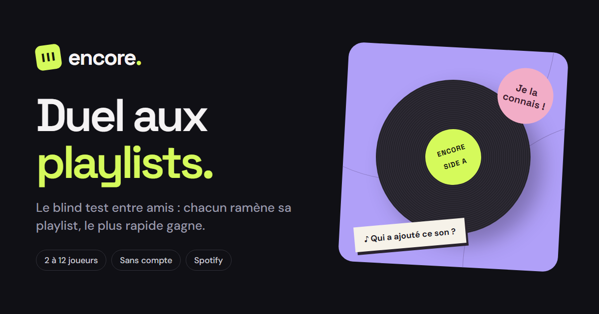

<!-- Bannière haute -->
<p align="center">
  
</p>

<p align="center">
  
</p>

<p align="center">
  <strong>Le blind test multijoueur en français.</strong><br>
  Chacun ramène sa playlist Spotify, tout le monde écoute le même extrait, le plus rapide gagne.
</p>

<p align="center">
  <a href="#-démarrage-rapide"></a>
  
  
  
  <a href="LICENSE"></a>
</p>

<p align="center">
  <a href="https://github.com/zenitsu93/encore-duel-playlists/stargazers"></a>
  <a href="https://github.com/zenitsu93/encore-duel-playlists/issues"></a>
  <a href="https://github.com/zenitsu93/encore-duel-playlists/commits/main"></a>
  
</p>

<p align="center">
  <a href="#-fonctionnalités">Fonctionnalités</a> •
  <a href="#-démarrage-rapide">Démarrage</a> •
  <a href="#-comment-jouer">Comment jouer</a> •
  <a href="#-playlists--spotify">Spotify</a> •
  <a href="#-chat-vocal">Vocal</a> •
  <a href="#-déploiement">Déploiement</a> •
  <a href="#-architecture">Architecture</a> •
  <a href="#-tests">Tests</a>
</p>

---

## ✨ En bref

| | |
|---|---|
| 🎧 **Un blind test, pas un quiz** | Extraits audio réels (10 à 30 s), écoute classique ou progressive, QCM ou réponse écrite. |
| 👥 **2 à 12 joueurs, sans compte** | Un code de salon, un pseudo, un avatar. Rien à installer côté joueur. |
| 🎵 **Playlists Spotify** | Collez un lien public : titres, artistes et extraits sont importés. Cinq sélections prêtes à jouer. |
| 🃏 **Jokers, bonus, équipes** | 50/50, +5 secondes, bonus « Qui a ajouté ce son ? », équipes Or / Ciel. |
| 🎙️ **Vocal intégré** | Chat texte et vocal WebRTC dans la page du jeu, micro activé seulement sur demande. |
| 🪶 **Zéro dépendance** | Node.js pur. `npm start`, c'est tout. Aucun `node_modules`. |

---

## 🚀 Démarrage rapide

**Prérequis :** Node.js 20 ou supérieur (22 conseillé pour les tests).

```bash
git clone https://github.com/zenitsu93/encore-duel-playlists.git
cd encore-duel-playlists
npm start
```

Ouvrez **http://localhost:4317**. Le guide complet des règles est servi sur **http://localhost:4317/guide**.

| Variable | Rôle | Défaut |
|---|---|---|
| `PORT` | Port d'écoute du serveur | `4317` |
| `VOICE_ICE_SERVERS` | Tableau JSON de serveurs STUN/TURN pour le vocal | STUN public Google |
| `ENCORE_SERVER_URL` | Origine du serveur, utilisée uniquement par `build-launcher.mjs` | — |

> **Jouer sur le même Wi-Fi :** ouvrez l'adresse IP locale du serveur sur chaque appareil, par exemple `http://192.168.1.20:4317`, et autorisez le port dans le pare-feu.
> **Jouer à distance :** hébergez le serveur en HTTPS avec prise en charge des connexions SSE longues (voir [Déploiement](#-déploiement)).

---

## 🎮 Comment jouer

```
 1. Créer un salon  ──▶  2. Partager le code  ──▶  3. Ajouter des playlists
                                                           │
 6. Podium & revanche ◀──  5. Manches chronométrées ◀──  4. Régler la partie
```

1. **Créer un salon.** Le créateur participe à la partie et peut transférer son rôle.
2. **Inviter.** Partagez le code à 6 lettres ou le lien `?room=CODE`. Jusqu'à 12 joueurs.
3. **Ramener sa musique.** Lien Spotify public, sélection sauvegardée ou import manuel `Artiste | Titre | URL audio`.
4. **Régler la partie.** Réglages par défaut : 8 manches, 20 secondes, QCM, question titre + artiste, tirage équilibré, bonus et jokers activés.
5. **Jouer.** Tout le monde entend le même extrait au même moment. Plus la réponse est rapide, plus elle rapporte.
6. **Podium.** Classement individuel ou par équipe, récap personnel, export CSV, revanche en un clic.

<details>
<summary><strong>Détail des règles</strong></summary>

- **Questions :** titre, artiste ou les deux. QCM à 4 réponses ou réponse écrite avec tolérance limitée aux fautes.
- **Écoute classique :** un extrait de 10 à 30 secondes.
- **Écoute progressive :** extraits de 2, 5 puis 10 secondes aux instants 0, 7 et 17 d'une manche de 30 secondes.
- **Tirage équilibré :** chaque joueur voit ses morceaux tirés à tour de rôle. Sinon tirage aléatoire global.
- **Bonus « Qui a ajouté ce son ? » :** 25 points, tous les propriétaires d'un doublon sont acceptés.
- **Jokers :** 50/50 (QCM uniquement) et +5 secondes, chacun une fois par partie. Restitués si la manche est annulée.
- **Équipes Or / Ciel :** formées à taille égale au lancement, somme des scores individuels, podium d'équipe.
- **Réactions rapides** après chaque manche et en fin de partie, fréquence limitée.
- **Reconnexion automatique** dans le même onglet ; reprise de la dernière session depuis le même navigateur. Retour en spectateur jusqu'à la manche suivante si le joueur a manqué la préparation.
- **Rôle de créateur :** transfert manuel, ou automatique vers un joueur connecté après 15 secondes d'absence.
- **Préchargement audio collectif** avec délai maximal de 15 secondes. Une erreur de lecture signalée par un client annule la manche sans points.
</details>

---

## 🎵 Playlists & Spotify

### Cinq sélections prêtes à jouer

| Sélection | Ambiance |
|---|---|
| 🔥 **Karaoke** | Les refrains que tout le monde connaît |
| 🎤 **Variét' FR** | Chanson française, toutes époques |
| 👑 **King of Pop** | Michael Jackson, de A à Z |
| 🌸 **Love Songs** | Ballades et slows |
| 🇧🇫 **Faso Vibes** | Sons du Burkina Faso |

Liste dans `playlists.mjs`, instantanés JSON dans `public/playlists/`.

### Import par lien Spotify

Le serveur lit uniquement les données exposées par la **page publique** de la playlist : métadonnées et URLs d'extraits. Timeout de 20 secondes, cache de 5 minutes, validation du domaine, aucune redirection suivie.

- Maximum **100 morceaux** par import, **1 000 morceaux distincts** par salon. Le premier import remplace la démo.
- Déduplication artiste / titre avec conservation de tous les contributeurs.
- Les titres sans extrait sont exclus et comptés dans le résultat d'import.
- Les playlists privées et les pages au format inconnu sont refusées avec un message clair.

```bash
# Générer un instantané JSON + CSV depuis une copie HTML d'une page publique
node import-spotify.mjs playlist-page.html
```

> ⚠️ L'audio est lu depuis les liens distants, jamais téléchargé sur le serveur. Ces liens peuvent expirer. L'accès technique n'accorde aucun droit de réutilisation : les conditions Spotify relatives aux jeux restent applicables. Encore est un prototype entre amis, pas une validation de diffusion publique.

---

## 🎙️ Chat vocal

Le bouton flottant **« Entre amis »** ouvre les messages et le vocal directement dans la page du jeu.

- **Rejoindre le vocal** démarre en écoute seule. Le micro n'est demandé qu'avec **« Activer mon micro »**.
- Chaque participant peut être coupé localement sans toucher à la musique.
- Quitter le vocal ou le salon coupe le micro et ferme les connexions.
- Signalisation privée via HTTP/SSE à l'intérieur du salon authentifié, audio en pair-à-pair WebRTC. La caméra n'est jamais activée.

Le micro exige **HTTPS ou localhost**. Pour les réseaux qui bloquent les connexions directes, configurez un relais TURN :

```json
[
  { "urls": "stun:stun.l.google.com:19302" },
  { "urls": "turn:turn.example.com:3478", "username": "user", "credential": "password" }
]
```

Ce tableau se place dans la variable `VOICE_ICE_SERVERS` (prioritaire) ou, en local, dans `voice-ice.local.json` à la racine. Le fichier est ignoré par Git, jamais servi publiquement, et relu à chaque entrée dans le vocal. Utilisez des identifiants TURN dédiés et limités : ils sont transmis aux membres du salon.

---

## ☁️ Déploiement

### Serveur

N'importe quel hébergeur Node.js avec HTTPS et connexions SSE longues. Le serveur expose `/api/health` pour les sondes.

### Écran de réveil Render

Sur Render en offre gratuite, le serveur s'endort. Le dossier `launcher/` contient une page d'attente aux couleurs d'Encore (vinyle animé) qui sonde `/api/health` puis ouvre le jeu dès que le serveur répond, en conservant les paramètres du lien comme `?room=ABCDEF`. Après deux minutes sans réponse, elle propose de réessayer. Les animations respectent la préférence de réduction des mouvements.

Cette page doit vivre sur un **Static Site séparé** : une page servie par le serveur endormi ne peut pas s'afficher avant l'écran d'attente de Render.

1. Déployer le serveur Node (Web Service).
2. Créer un **Static Site** depuis le même dépôt.
3. Définir `ENCORE_SERVER_URL` sur l'origine du serveur, par exemple `https://mon-jeu.onrender.com`.
4. Build Command : `node build-launcher.mjs` — Publish Directory : `dist-launcher`.
5. Partager l'adresse du **Static Site** comme point d'entrée. Pour une invitation : `?room=CODE`.

```bash
# Prévisualisation locale du launcher
ENCORE_SERVER_URL=http://localhost:4317 node build-launcher.mjs
# puis servir dist-launcher/ sur un autre port, en gardant npm start pour le jeu
```

---

## 🏗️ Architecture

```
encore-duel-playlists/
├── server.mjs            # Serveur HTTP natif : statique, /api/health, /api/events (SSE), POST /api/*
├── engine.mjs            # Salons, joueurs, manches, scores, jokers, équipes, diffusion d'état
├── game.mjs              # Logique pure : questions, barème, tolérance des réponses, tirage équilibré
├── playlists.mjs         # Sélections sauvegardées
├── spotify-import.mjs    # Import réseau d'une playlist publique, cache 5 min
├── import-spotify.mjs    # CLI : instantané JSON + CSV depuis une page HTML
├── voice.mjs             # Signalisation vocale à l'intérieur d'un salon
├── ice-config.mjs        # Lecture de VOICE_ICE_SERVERS / voice-ice.local.json
├── build-launcher.mjs    # Génère dist-launcher/ pour le Static Site
├── launcher/             # Page de réveil Render
├── public/               # Client : index, guide, app.js, voice.js, style, avatars, playlists
└── test/                 # Tests unitaires, DOM simulé, HTTP/SSE, vocal
```

| Couche | Choix | Pourquoi |
|---|---|---|
| Serveur | `node:http` | Aucune dépendance, démarrage instantané, surface d'attaque minimale |
| Temps réel | Server-Sent Events | Un flux descendant par joueur, actions en POST, reconnexion native du navigateur |
| État | En mémoire | Salons vides purgés après deux heures ; un redémarrage efface tout |
| Scores | Calculés côté serveur | Le client ne décide jamais des points |
| Vocal | WebRTC pair-à-pair | Le serveur ne relaie jamais l'audio, seulement la signalisation |
| Identité | Jeton dans le navigateur | Reprise de session sans compte |

### API

| Méthode | Route | Rôle |
|---|---|---|
| `GET` | `/api/health` | Sonde de disponibilité, utilisée par le launcher |
| `GET` | `/api/events` | Flux SSE d'état du salon pour un joueur authentifié |
| `POST` | `/api/*` | Actions de jeu : création, entrée, import, prêt, réponse, jokers, vocal… |

---

## 🧪 Tests

```bash
npm test                  # logique de jeu, client avec DOM simulé, Spotify, vocal simulé
npm run test:integration  # partie complète à deux en HTTP/SSE (serveur lancé au préalable)
```

Couverture des tests de logique : barèmes, réponses libres, répartition des sélections, bonus, équipes, jokers privés, annulation et restauration des jokers, événements périmés, préchargement, transfert de rôle. Le test d'intégration joue une partie entière avec chargement, points, réaction, revanche et transfert manuel.

<details>
<summary><strong>Diagnostic vocal réel (optionnel)</strong></summary>

Sans micro physique, avec un WebRTC natif installé temporairement :

```bash
npm install --no-save --package-lock=false --ignore-scripts @roamhq/wrtc
node test/voice-real.mjs                                   # WebRTC local
node test/voice-real.mjs --relay                           # force le relais TURN configuré
node test/voice-real.mjs --server=https://votre-site.onrender.com   # signalisation du serveur déployé
```

Le script crée un salon de diagnostic, transmet un son synthétique entre deux participants, vérifie la réception dans les deux sens puis quitte. Il ne valide ni les permissions ni la sortie audio des navigateurs mobiles.
</details>

---

## ⚠️ Limites connues

- Salons et résultats **en mémoire** : un redémarrage les efface.
- Pas de système de comptes : les identités vivent dans le navigateur.
- Les URLs audio sont inspectables et un signalement client peut annuler une manche : **usage entre amis, sans protection contre la triche**.
- Spotify n'expose souvent que 100 morceaux par page publique, sans pagination.
- Un joueur déconnecté peut manquer des manches ; la synchronisation dépend du réseau.

## 🗺️ Avant une ouverture publique

- [ ] Persistance des salons et des scores
- [ ] Authentification adaptée
- [ ] Limitation globale de requêtes et supervision
- [ ] Modération des imports
- [ ] Source musicale autorisée pour la diffusion

---

## 🙏 Crédits

- **Avatars** : style « Big Smile » par Ashley Seo, licence [CC BY 4.0](https://creativecommons.org/licenses/by/4.0/), générés avec [DiceBear](https://www.dicebear.com).
- **Références** : [getUserMedia](https://developer.mozilla.org/en-US/docs/Web/API/MediaDevices/getUserMedia), [relais TURN](https://webrtc.org/getting-started/turn-server).

## 📄 Licence

Distribué sous licence **MIT**. Voir [LICENSE](LICENSE).

---

<p align="center">
  Créé avec 🎶 par <a href="https://github.com/zenitsu93"><strong>Christian Thomas BADOLO</strong></a>
</p>

<p align="center">
  
</p>
